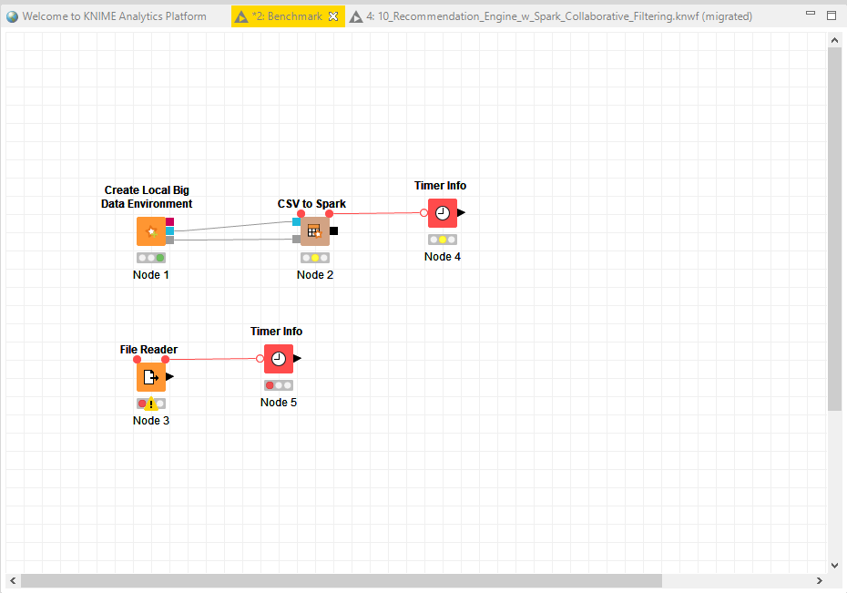
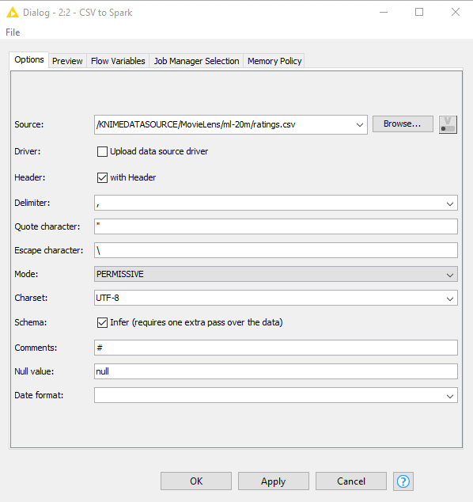
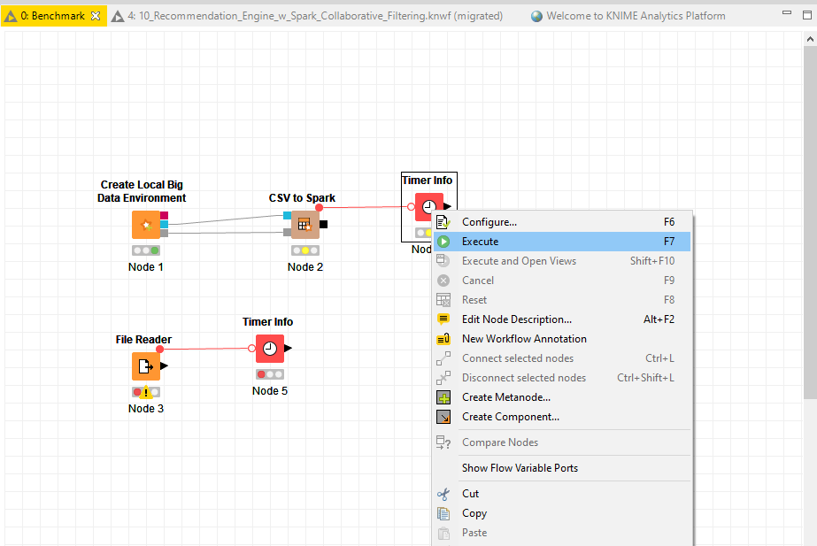
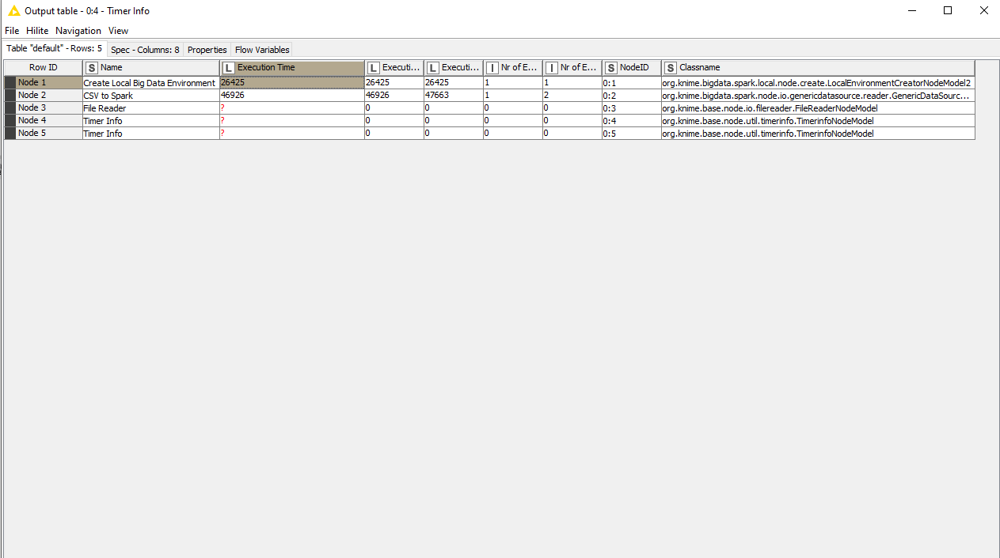
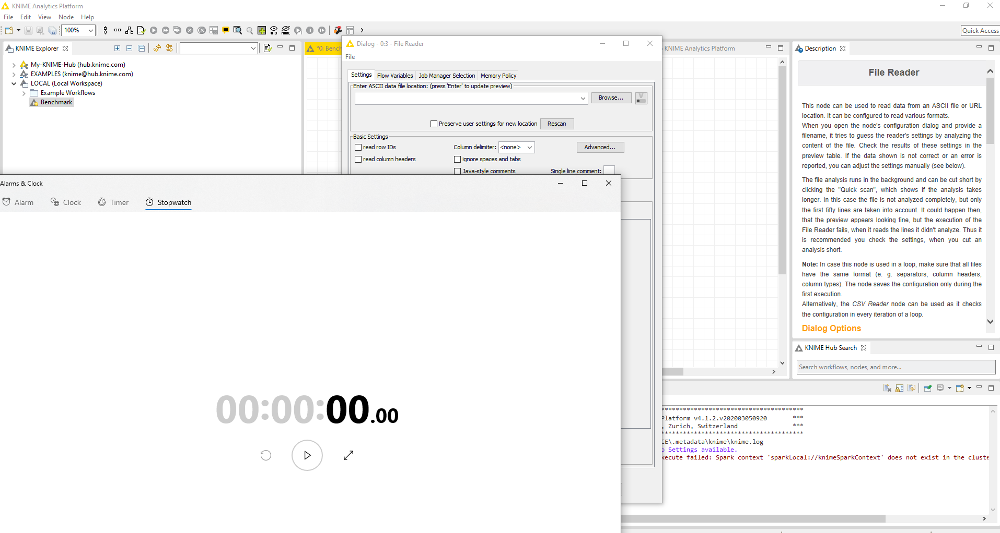
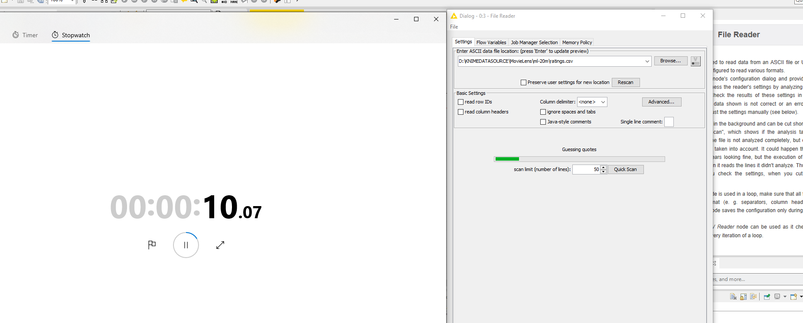
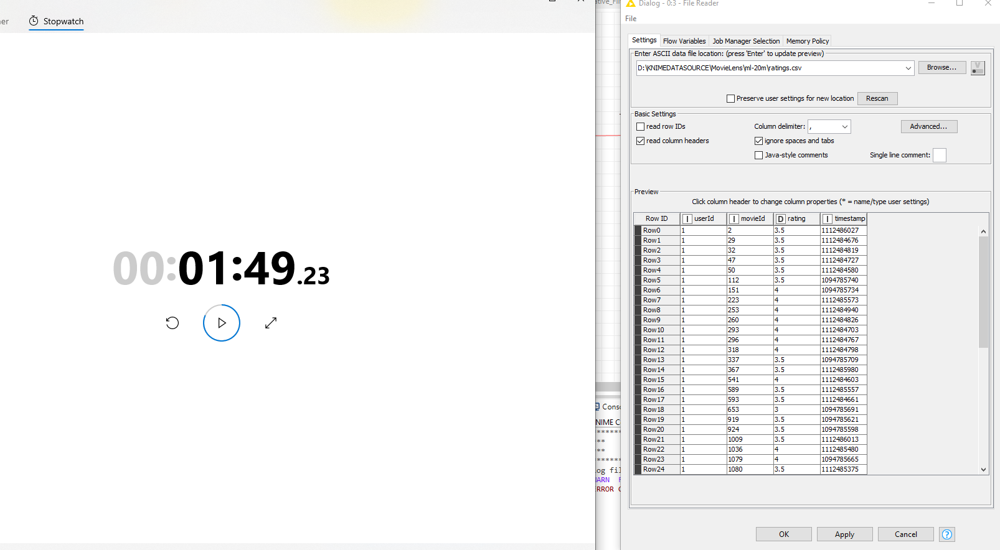
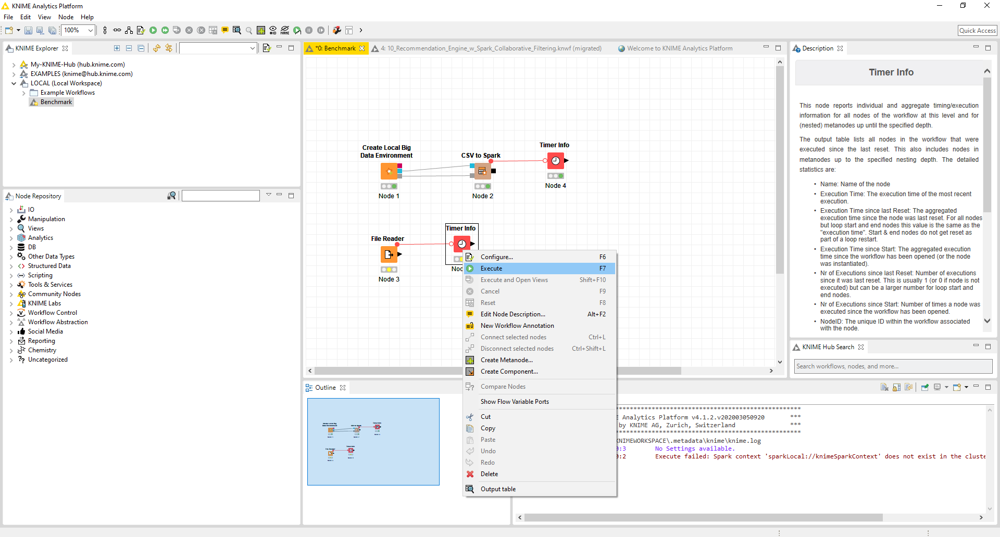
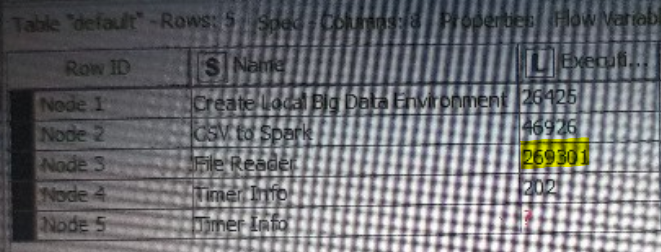

# Implementasi Algoritma Rekomendasi Menggunakan KNIME

Oleh : Alifa Izzan

## Daftar Isi

- [Implementasi Algoritma Rekomendasi Menggunakan KNIME](#implementasi-algoritma-rekomendasi-menggunakan-knime)
  - [Daftar Isi](#daftar-isi)
  - [Pengujian Node dan Kesimpulan Pengujian](#pengujian-node-dan-kesimpulan-pengujian)
    - [Pengujian Node](#pengujian-node)
    - [Kesimpulan](#kesimpulan)

## Pengujian Node dan Kesimpulan Pengujian

### Pengujian Node

Pada workflow disebutkan bahwa terdapat dua cara untuk membaca data, pertama menggunakan node CSVtoSpark dan node File Reader. Untuk itu diperlukan pengujian waktu dalam penggunaan kedua node tersebut. Kedua node diuji untuk membaca tabel ratings.csv

Untuk menguji node menggunakan workflow dibawah ini:

- Pertama konfigurasi masing masing node untuk melakukan pembacaan

- Lalu tekan tombol execute pada node timer untuk csvtospark

- Hasilnya adalah:

- Pada CSVtoSpark membutuhkan total waktu: **73,36 detik**

- Untuk pengujian File Reader siapkan stopwatch

-  browse file ratings.csv dan mulai stopwatch

- stop ketika dataframe muncul pada interface

- selanjutnya execute node timer

- hasilnya adalah:

- File Reader membutuhkan total waktu **378,531 detik** setelah ditambah waktu yang manual dihitung dengan stopwatch

### Kesimpulan

| Node | Waktu |
| :--- | :---- |
| CSVtoSpark | 73,36 |
| File Reader | 378,531 |

Kedua metode telah diuji menggunakan kombinasi fitur Timer Info dan pengukuran manual. kombinasi tersebut diperlukan untuk melakukan pengukuran proses setting yang membutuhan membaca data yang tidak masuk kedalam node Timer Info pada node File Reader karena proses tersebut membutuhkan waktu yang cukup signifikan. Dan akan adil karena saya juga mengukur proses pembuatan Environtment Big Data. tentunya pengukuran manual memiliki deviasi +- 1 detik error.

Kesimpulan yang didapat node CSVtoSpark lebih cepat **502%** dengan error **+- 1%** pada pengujian kali ini.