# Implementasi Algoritma Rekomendasi Menggunakan KNIME

Oleh : Alifa Izzan

## Daftar Isi

- [Implementasi Algoritma Rekomendasi Menggunakan KNIME](#implementasi-algoritma-rekomendasi-menggunakan-knime)
  - [Daftar Isi](#daftar-isi)
  - [Preproses Workflow](#preproses-workflow)
    - [Mengubah Node Server KNIME](#mengubah-node-server-knime)
  - [CRISP-DM](#crisp-dm)
    - [Bussiness Understanding](#bussiness-understanding)
    - [Data Understanding](#data-understanding)
    - [Data Preparation](#data-preparation)
    - [Modeling](#modeling)
    - [Evaluation](#evaluation)
    - [Deployment](#deployment)
  - [Pengujian Node dan Kesimpulan Pengujian](#pengujian-node-dan-kesimpulan-pengujian)
    - [Pengujian Node](#pengujian-node)
    - [Kesimpulan](#kesimpulan)

## Preproses Workflow

### Mengubah Node Server KNIME

- Pertama unduh file workflow dari web dan lakukan migrasi
- Ikuti petunjuk wizard
- Tampilan workflow awal
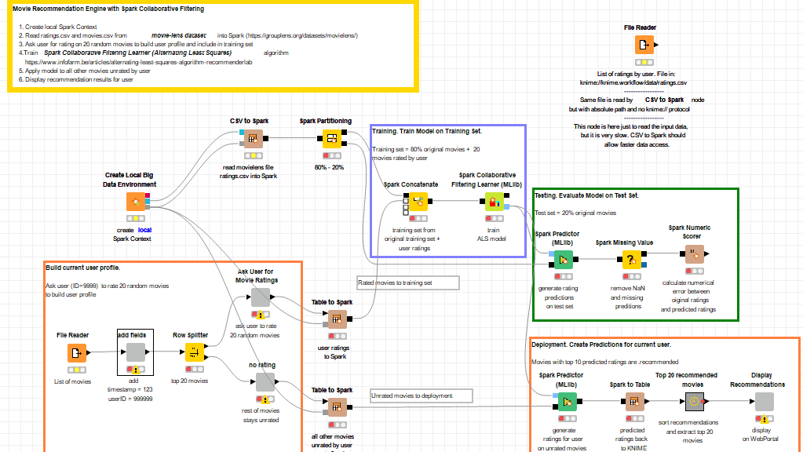
- Lalukan setting untuk mengarahkan ratings.csv dan movies.csv jangan lupa file reader pada node sorting untuk di setting juga.
- Buka komponen ask user...
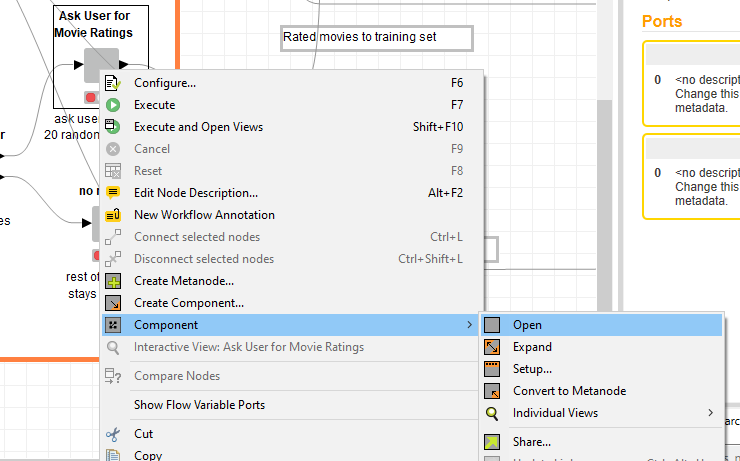
- di dalam komponen tersebut ubah menjadi seperti ini:
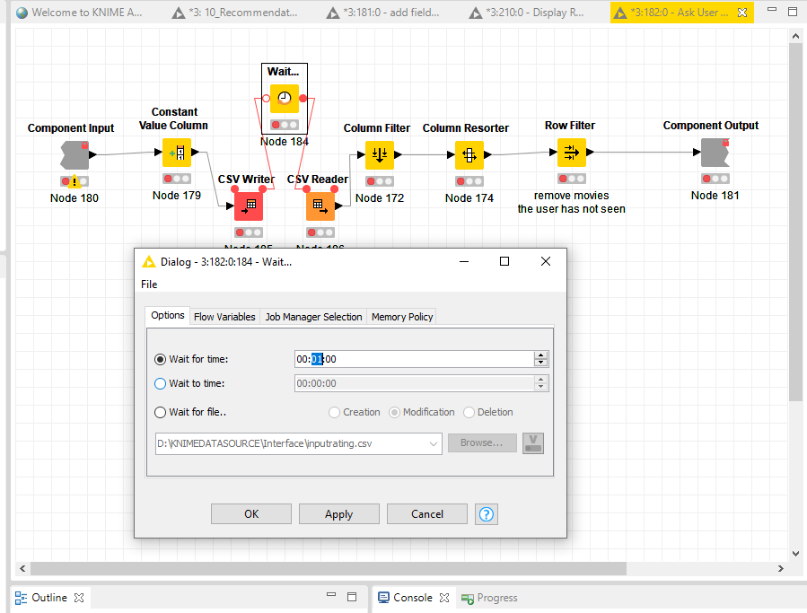
- pada kali ini kita pakai file temporary bernama inputrating.csv dan tambahkan wait node  untuk menunggu 1 menit untuk menunggu input dari user
- selanjutnya buka komponen Display Recommendation
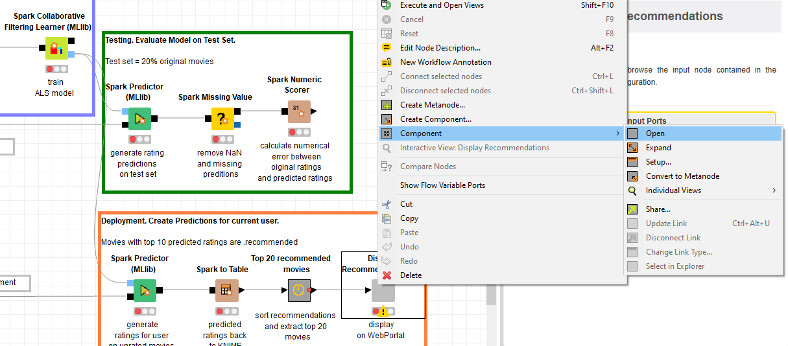
- hapus tabel editor dan text display lalu ganti dengan csvwriter
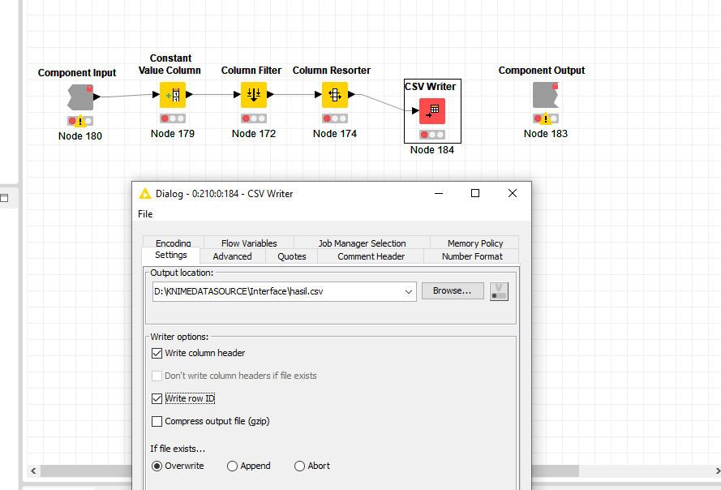

## CRISP-DM

### Bussiness Understanding

Pada kali ini dibutuhkan rekomendasi film yang akurat.

### Data Understanding

Sumber data berasal dari movieLens 20M data yang dipakai adalah movies.csv (movieId, title, genres) dan ratings.csv (userId, movieId, rating, timestamp) juga terdapat input data dari user menggunakan inputrating.csv (movieId, title, genres, userId, ratings)

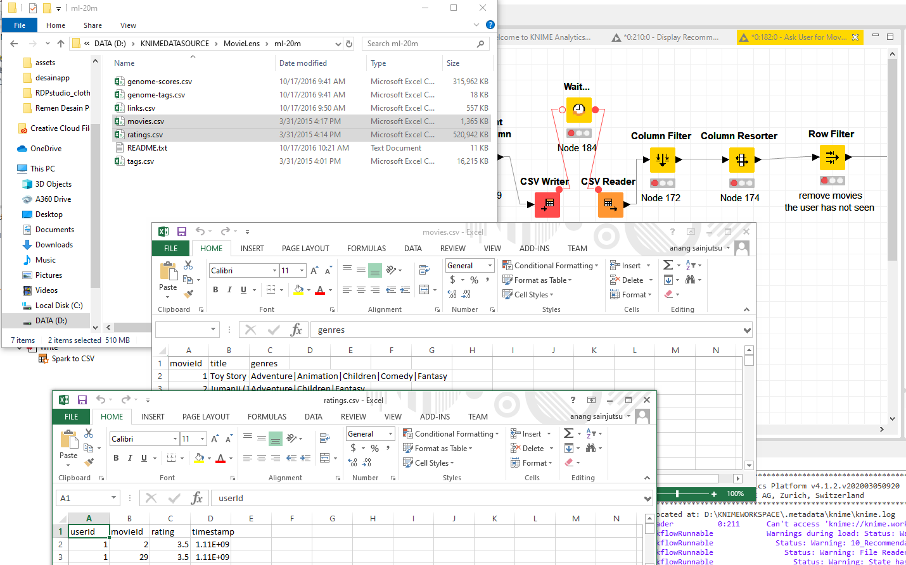

### Data Preparation

Sebelum dilakukan pembuatan model data di proses terlebih dahulu.

untuk movies.csv:
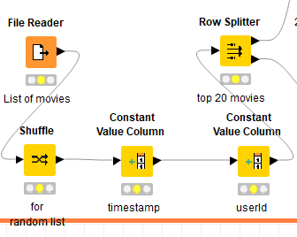

data movies.csv diacak lalu ditambahkan kolom konstan dan di pisah untuk diproses lebih lanjut

untuk ratings.csv:

data ratings.csv dipartisi untuk train set dan test set

untuk inputrating.csv:
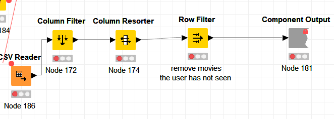

rating yang tidak diisi oleh user dihapus

### Modeling

Pemodelan pada workflow ini menggunakan Colaborative Filtering dari Spark

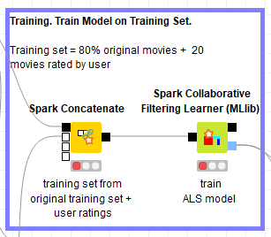

### Evaluation

Model yang telah dibuat diuji menggunakan 20% data rating untuk dicari nilai errornya. ketika error dibawah yang ditetapkan pada proses bisnis maka model dapat di deploy.

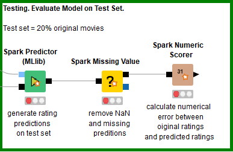

### Deployment

Pada kali ini data disajikan dalam bentuk hasil.csv. di dalamnya terdapat top 20 rekomendasi film yang dihasilkan oleh model.

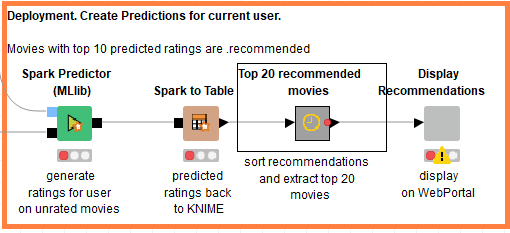

## Pengujian Node dan Kesimpulan Pengujian

### Pengujian Node

Pada workflow disebutkan bahwa terdapat dua cara untuk membaca data, pertama menggunakan node CSVtoSpark dan node File Reader. Untuk itu diperlukan pengujian waktu dalam penggunaan kedua node tersebut. Kedua node diuji untuk membaca tabel ratings.csv

Untuk menguji node menggunakan workflow dibawah ini:

- Pertama konfigurasi masing masing node untuk melakukan pembacaan

- Lalu tekan tombol execute pada node timer untuk csvtospark

- Hasilnya adalah:

- Pada CSVtoSpark membutuhkan total waktu: **73,36 detik**

- Untuk pengujian File Reader siapkan stopwatch

-  browse file ratings.csv dan mulai stopwatch

- stop ketika dataframe muncul pada interface

- selanjutnya execute node timer

- hasilnya adalah:

- File Reader membutuhkan total waktu **378,531 detik** setelah ditambah waktu yang manual dihitung dengan stopwatch

**pastikan anda reset semua node sebelum melakukan salah satu pengujian**

**ulangi step pegujian sesuai yang anda rasa cukup**

### Kesimpulan

| Node | Pengujian 1 | Pengujian 2 | Pengujian 3 | Rata-Rata |
| :--- | :---- |:--- | :---- | :---- |
| CSVtoSpark | 73.36 | 63.13 | 78.41 | 71.63 |
| File Reader | 378.53 | 266.96 | 281.57 | 309.02 |

Kedua metode telah diuji menggunakan kombinasi fitur Timer Info dan pengukuran manual. kombinasi tersebut diperlukan untuk melakukan pengukuran proses setting yang membutuhan membaca data yang tidak masuk kedalam node Timer Info pada node File Reader karena proses tersebut membutuhkan waktu yang cukup signifikan. Dan akan adil karena saya juga mengukur proses pembuatan Environtment Big Data. tentunya pengukuran manual memiliki human error, namun bisa diabaikan karena nilainya kecil.

Kesimpulan yang didapat node CSVtoSpark rata-rata dapat membaca lebih cepat **431%** dari pada menggunakan node File Reader.

Workflow pengujian dapat dilihat pada Benchmark.knwf